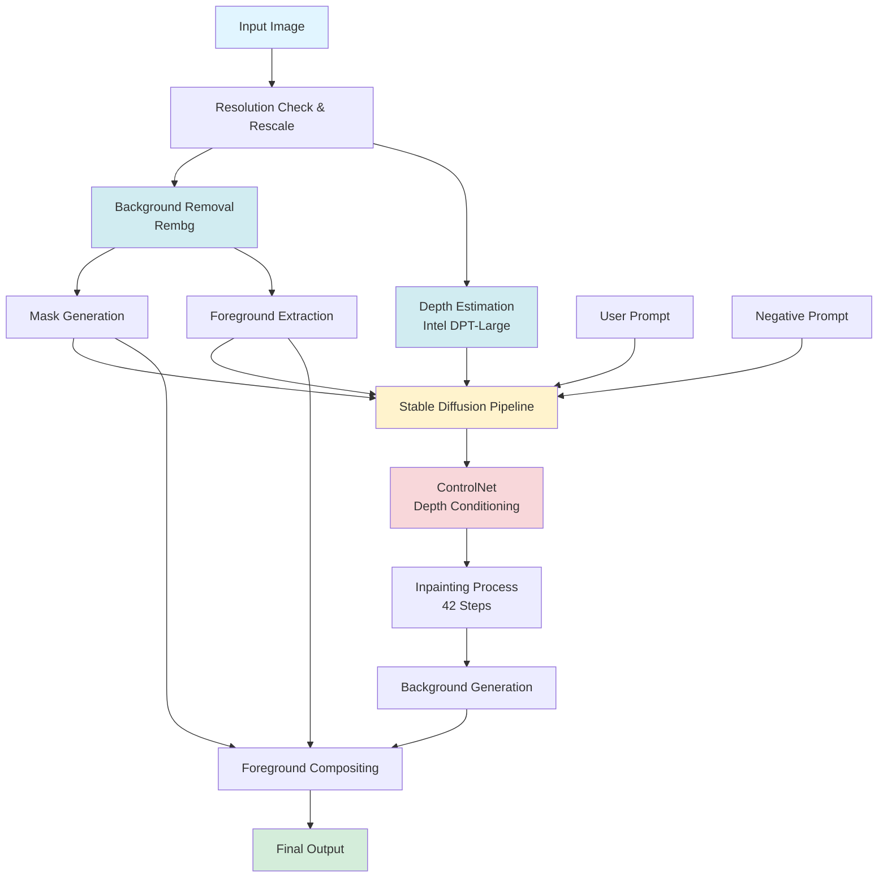

# 🎨 AI Background Generator

An intelligent image processing pipeline that combines background removal, depth estimation, and AI-powered inpainting to generate stunning, contextually appropriate backgrounds for images using Stable Diffusion and ControlNet.

[](https://www.python.org/downloads/)
[](https://pytorch.org/)
[](https://developer.nvidia.com/cuda-toolkit)
[](https://gradio.app/)

## 📋 Table of Contents

- [Overview](#overview)
- [Features](#features)
- [Architecture](#architecture)
- [Installation](#installation)
- [Usage](#usage)
- [Technical Details](#technical-details)
- [Examples](#examples)
- [Hardware Requirements](#hardware-requirements)
- [Troubleshooting](#troubleshooting)
- [Contributing](#contributing)
- [License](#license)

## 🎯 Overview

This project leverages state-of-the-art AI models to automatically remove image backgrounds and regenerate them based on user prompts. The system uses a sophisticated pipeline that combines:

- **Rembg** for precise background removal
- **Intel DPT-Large** for depth estimation
- **ControlNet** for depth-guided generation
- **Stable Diffusion Inpainting** for realistic background synthesis
- **Gradio** for an intuitive web interface

The result is a powerful tool that can transform any image by replacing its background while maintaining the original subject's depth, lighting, and perspective.

## ✨ Features

- **Automatic Background Removal**: Uses Rembg to accurately segment and remove backgrounds from uploaded images
- **Depth-Aware Generation**: Employs Intel's DPT-Large model to understand scene geometry
- **AI-Powered Inpainting**: Leverages Stable Diffusion v1.5 with ControlNet for photorealistic background generation
- **Smart Resolution Handling**: Automatically resizes images to optimal dimensions while maintaining aspect ratio
- **Custom Prompts**: Full control over generated backgrounds through positive and negative prompts
- **Foreground Preservation**: Seamlessly composites the original subject onto the new background
- **Web Interface**: User-friendly Gradio interface for easy interaction
- **GPU Accelerated**: Optimized for CUDA-enabled GPUs for fast processing

## 🏗️ Architecture



### Pipeline Stages

1. **Image Preprocessing**
   - Resolution validation and rescaling (max 1024x1024)
   - Dimension adjustment to multiples of 8 for model compatibility

2. **Background Removal**
   - Rembg processes the image to create a binary mask
   - Foreground object is extracted with transparent background
   - Inverted mask is generated for inpainting

3. **Depth Estimation**
   - Intel DPT-Large model analyzes scene depth
   - Generates depth map for spatial understanding
   - Provides geometric constraints for realistic generation

4. **AI Generation**
   - ControlNet uses depth map to guide generation
   - Stable Diffusion inpaints masked background areas
   - 42 inference steps ensure high-quality output
   - DDIM scheduler for stable diffusion process

5. **Compositing**
   - Original foreground is overlaid on generated background
   - Seamless blending using alpha masking
   - Final image assembly with preserved subject quality

## 🚀 Installation

### Prerequisites

Ensure you have the following installed:

- Python 3.8 or higher
- CUDA-compatible GPU (NVIDIA)
- CUDA Toolkit 11.7+ and cuDNN
- Git

### Step 1: Clone the Repository

```bash
git clone https://github.com/baloglu321/Background-Generator.git
cd Background-Generator
```

### Step 2: Create Virtual Environment (Recommended)

```bash
# Using venv
python -m venv venv

# Activate on Windows
venv\Scripts\activate

# Activate on Linux/Mac
source venv/bin/activate
```

### Step 3: Install Dependencies

```bash
# Install PyTorch with CUDA support (adjust CUDA version as needed)
pip install torch torchvision torchaudio --index-url https://download.pytorch.org/whl/cu118

# Install other requirements
pip install diffusers transformers accelerate
pip install rembg[gpu]
pip install gradio opencv-python pillow numpy
```

### Step 4: Download Models

The models will be automatically downloaded on first run from Hugging Face:
- `lllyasviel/sd-controlnet-depth` (ControlNet model)
- `Uminosachi/realisticVisionV51_v51VAE-inpainting` (Stable Diffusion model)
- `Intel/dpt-large` (Depth estimation model)

**Note**: First run may take several minutes to download models (~15GB total).

## 💻 Usage

### Starting the Application

```bash
python gradio_infer.py
```

The Gradio interface will launch automatically and open in your default browser (typically at `http://localhost:7860`).

### Using the Interface

1. **Upload Image**: Click on the image upload area and select your input image
2. **Enter Prompt**: Describe the desired background (e.g., "A car on a mountain road, Landscape")
3. **Negative Prompt** (Optional): Specify what to avoid in the generation
4. **Click "Yükle" (Load)**: The system will process your image
5. **View Results**: The generated image appears in the output panel
6. **Download**: Click the download icon on the output image to save it

### Example Prompts

**Good Prompts:**
- "A car on a mountain road, beautiful landscape, sunset, 4k, highly detailed"
- "Professional studio background, white backdrop, soft lighting"
- "Tropical beach scene, sunset, palm trees, golden hour"
- "Modern city street, bokeh background, evening lights"

**Negative Prompt Tips:**
The system automatically appends quality-related negative prompts. You can add specific elements to avoid:
- "people, humans, crowds"
- "rain, snow, bad weather"
- "distorted, blurry, low quality"

## 🔧 Technical Details

### Models Used

| Component | Model | Purpose |
|-----------|-------|---------|
| Background Removal | Rembg (U2-Net) | Foreground segmentation |
| Depth Estimation | Intel DPT-Large | Scene geometry analysis |
| ControlNet | lllyasviel/sd-controlnet-depth | Depth-conditioned generation |
| Base Model | Realistic Vision V5.1 VAE | Photorealistic inpainting |

### Key Parameters

```python
steps = 42                  # Inference steps for quality
max_resolution = 1024       # Maximum dimension
seed = random.randint()     # Random seed per generation
eta = 1.0                   # DDIM scheduler parameter
torch_dtype = float16       # Half precision for efficiency
```

### File Structure

```
Background-Generator/
├── gradio_infer.py         # Main Gradio interface and pipeline
├── image_utils.py          # Image processing utilities
├── images/                 # Example outputs
├── README.md              # This file
└── requirements.txt       # Python dependencies (create if needed)
```

### Core Functions

**image_utils.py:**
- `generate_mask()`: Removes background and creates mask using Rembg
- `generate_dept()`: Generates depth map using Intel DPT-Large
- `check_max_resolution_rescale()`: Resizes image to optimal dimensions
- `add_fg()`: Composites foreground onto generated background
- `make_inpaint_condition()`: Prepares conditioning for inpainting

**gradio_infer.py:**
- `generate()`: Main pipeline orchestrating all processing steps
- Initializes and manages Stable Diffusion pipeline
- Handles Gradio interface and user interactions

## 📸 Examples

### Example 1: Mountain Road Scene

**Input:** Orange car with plain background  
**Prompt:** "A car on a mountain road, Landscape"  
**Result:** Car placed on a scenic mountain highway with dramatic landscape


### Example 2: Beach Sunset Scene

**Input:** Blue SUV with studio background  
**Prompt:** "A car parked on a road by the beach, Beautiful landscape, Sunset, Beautiful sunny weather, Cloudy sky"  
**Result:** Vehicle on coastal road with golden sunset and ocean view


## 💾 Hardware Requirements

### Minimum Requirements

- **GPU**: NVIDIA GPU with 8GB VRAM (RTX 3060 or better)
- **RAM**: 16GB system memory
- **Storage**: 20GB free space (for models and processing)
- **OS**: Windows 10/11, Linux (Ubuntu 20.04+), or macOS with CUDA support

### Recommended Specifications

- **GPU**: NVIDIA RTX 3080 or better (10GB+ VRAM)
- **RAM**: 32GB system memory
- **Storage**: SSD with 30GB+ free space
- **CPU**: Modern multi-core processor (Intel i7/AMD Ryzen 7+)

### Performance Notes

- Average processing time: 30-60 seconds per image (depending on GPU)
- Memory usage increases with higher resolutions
- First run is slower due to model downloads and initialization
- Batch processing is not currently supported

## 🐛 Troubleshooting

### Common Issues

**Problem: CUDA Out of Memory Error**
```
Solution: Reduce image resolution or close other GPU applications
- Images are automatically capped at 1024x1024
- Try restarting the application to clear GPU memory
```

**Problem: Models fail to download**
```
Solution: Check internet connection and Hugging Face access
- Ensure you have stable internet connection
- Models are ~15GB total, may take time
- Check if firewall is blocking downloads
```

**Problem: Rembg not removing background correctly**
```
Solution: Ensure image has clear subject-background contrast
- Works best with well-lit subjects
- Avoid images where subject blends into background
```

**Problem: Generated backgrounds don't match prompt**
```
Solution: Improve prompt specificity
- Add more descriptive details
- Use negative prompts to exclude unwanted elements
- Try different random seeds by re-running
```

### Debug Mode

To enable verbose logging, modify `gradio_infer.py`:

```python
import logging
logging.basicConfig(level=logging.DEBUG)
```

## 🤝 Contributing

Contributions are welcome! Here's how you can help:

1. Fork the repository
2. Create a feature branch (`git checkout -b feature/AmazingFeature`)
3. Commit your changes (`git commit -m 'Add some AmazingFeature'`)
4. Push to the branch (`git push origin feature/AmazingFeature`)
5. Open a Pull Request

### Areas for Improvement

- Batch processing support
- Additional ControlNet options (canny, pose, etc.)
- Model selection UI
- Image resolution presets
- Processing history and favorites
- Advanced parameter controls
- Multi-language support

## 📄 License

This project is provided as-is for educational and research purposes. Please note:

- Model licenses: Each model has its own license (see Hugging Face model cards)
- Rembg: MIT License
- Diffusers: Apache 2.0 License
- Commercial use: Check individual model licenses for commercial restrictions

## 🙏 Acknowledgments

- [Rembg](https://github.com/danielgatis/rembg) for background removal
- [Diffusers](https://github.com/huggingface/diffusers) by Hugging Face
- [ControlNet](https://github.com/lllyasviel/ControlNet) by Lvmin Zhang
- [Realistic Vision](https://civitai.com/models/4201/realistic-vision-v51) model creators
- [Intel DPT](https://github.com/isl-org/DPT) for depth estimation
- [Gradio](https://gradio.app/) for the interface framework

## 📧 Contact

Project Link: [https://github.com/baloglu321/Background-Generator](https://github.com/baloglu321/Background-Generator)

---

**Note**: This project requires significant GPU resources. Ensure your system meets the minimum requirements before installation. For best results, use high-quality input images with clear subjects.
